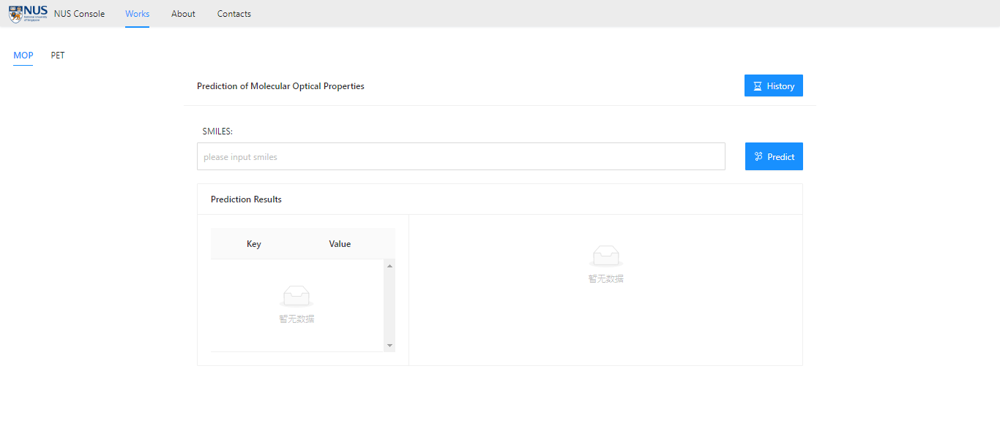
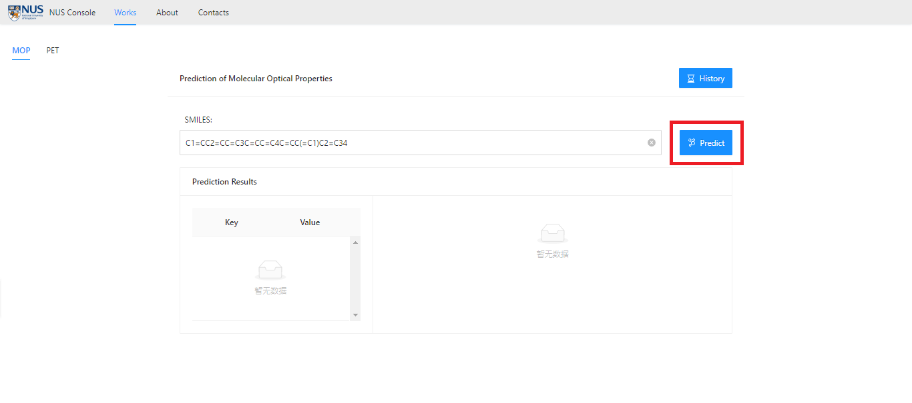
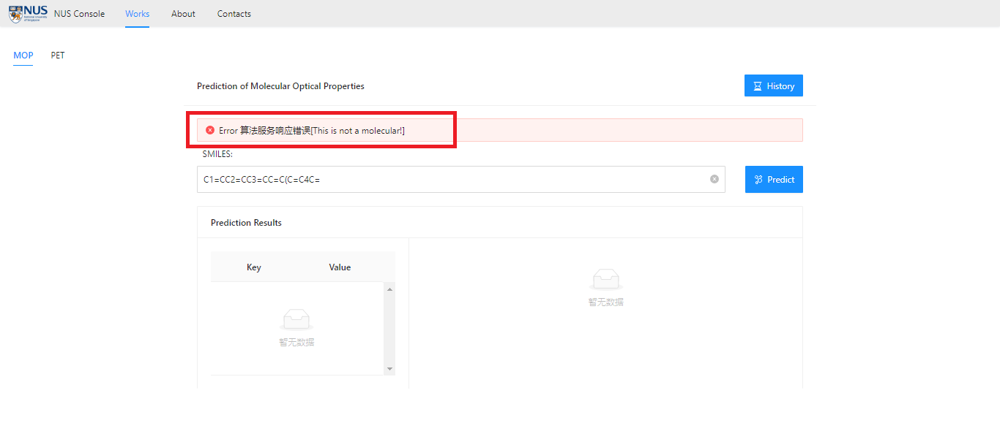
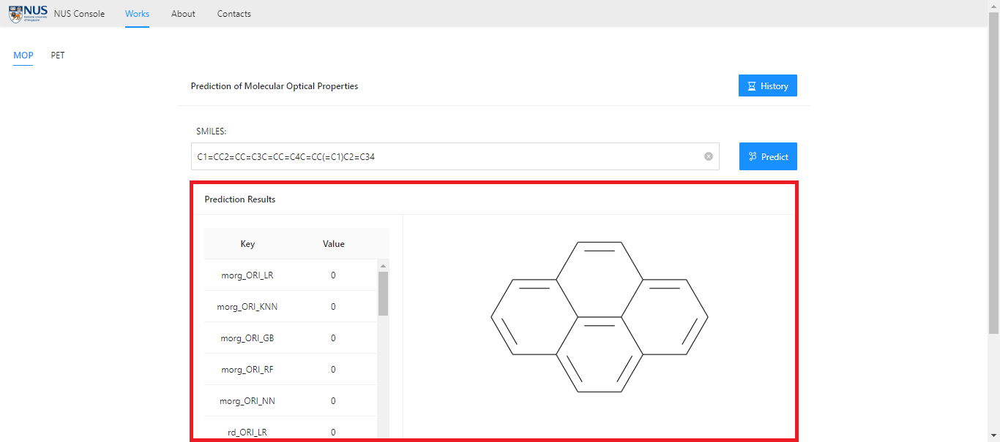
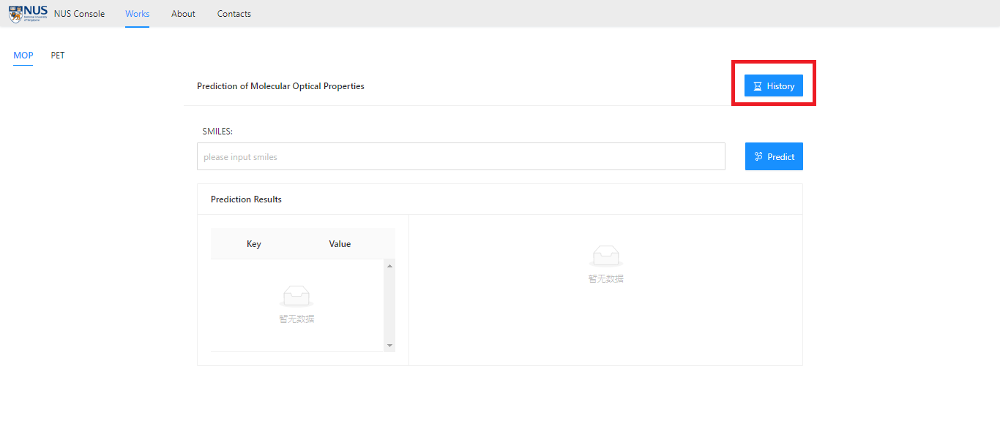
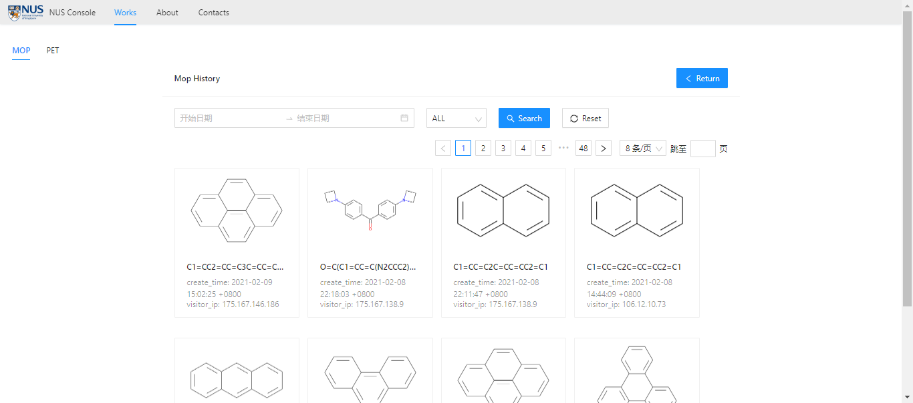
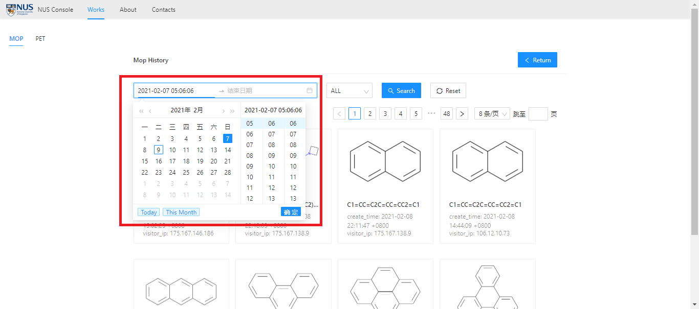
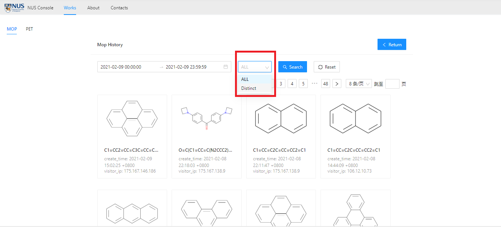
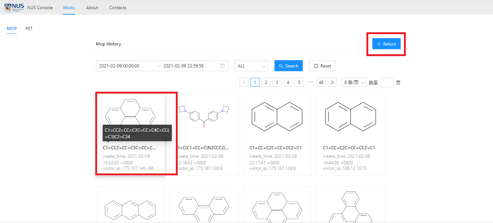

# Prediction of Molecular Optical Properties
## Paper

Submmited.

## Dataset

Dataset is composed of molecules with aggregation-induced emission (AIE) or aggregation caused quenching (ACQ) properties reported in the literature. When collecting data, we screened the molecules according to the following criteria: 1) capture representative AIE/ACQ counterparts that show similar molecular structures but opposite AIE/ACQ property; 2) screen molecules derived from the same AIE core, especially the classic cores. To avoid an unbalanced and biased dataset, we restricted the number of molecules derived from the same core. Totally , 356 molecules were collected for model training.

Download from:

Link:https://pan.baidu.com/s/1iWVFqAKTf98woIRWysyUbw  Password:q04b

Google Drive: https://drive.google.com/drive/folders/1pGOrmlgBuhh_LzuHcxRpuJxeacmfKj_I?usp=sharing

## Environment

- python  3.6
- numpy  1.19.0
- pandas  1.0.5
- deepchem   2.2.1.dev54
- scikit-learn  0.21.0
- rdkit  2020.09.1b.69

## Usage

- Train models through ten-fold cross-validation.

  - descriptors.py    

    Get descriptors features.

  - crossvalidation_index.py    

    Get ten-fold cross-validation index.

  - crossvalidation_data.py    

    Get ten-fold cross-validation data.

  - train_models_ori.py    

    Train different models based on single-modal data.

  - train_models_mul.py    

    Train different models based on multi-modal data.
    
  - calculate_measures.py

    Calculate AUC and F1-score.

  - ensemble.py

    Calculate the ensemble method prediction results.

  - calculate_ensemble_measures.py 

    Calculate measures for ensemble method, including accuracy, AUC, and F1-score.

- Train models through the whole data.
  - data_process_all.py
  - train_models_ori_all.py
  - train_models_mul_all.py
  - predict.py

## Pretrained Models

We provide pre-training models based on the whole data, which can help you predict your new data. 

We also use the models in our user interface. 

Download from:

Link:https://pan.baidu.com/s/1m8JyMSIze8E8UHqqUMcrGA  Password:j1b9

Google Drive: https://drive.google.com/drive/folders/1pGOrmlgBuhh_LzuHcxRpuJxeacmfKj_I?usp=sharing

## User Interface

We built a user interface for the project. The user can test the molecular optical properties through this interface. The models used here is the pre-trained models.

You can visit the following link into main page：

https://aiapp.zhwl.tech/nus/html/#/works

### Prediction

- Under "Smiles:", enter the molecule Smiles to Predict and click the "Predict" button to get the properties results.

- If you type an Error as Smiles, click "Predict" and you will see "Error algorithm service response Error [This is not a molecular!] ", prompt input error, please retype.

  

- In the "Predition Results" section below, the predicted values for individual optical properties of the molecule are shown on the left and the molecular structure diagram is shown on the right.

###  Query

- Click on "History" to go to the history page.

  

- On the history page, the test samples uploaded by the visitor are stored in a database (which is used for scientific research only), including the visitor's IP.

- The query is to search records by date. Click "Start Date", and a pop-up window will appear. You can select the start date and time of the search, and the time can be accurate to the specific hour, minute or second. Click "OK" to save. Again, click "End Date" to select the end date and time of the search.

- You can set whether to query for duplicates. "All" means contain duplicate items. "DISTINCT" means that there are no duplicates. Default is ALL. Click "Search" to Search.

  

- If you are interested in a particular molecular diagram, you want to view its optical properties. Click the "Return" button to return to the prediction page and query the optical properties of the molecule.

  

## Contact

Jiali Li [e0276496@u.nus.edu](mailto:e0276496@u.nus.edu)

Xiaoli Liu [neuxiaoliliu@163.com](mailto:neuxiaoliliu@163.com)

Shidang Xu [xushidang@u.nus.edu](mailto:xushidang@u.nus.edu)

