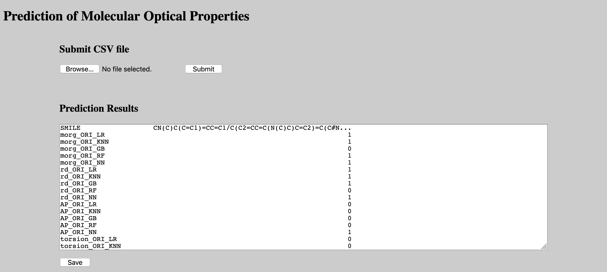
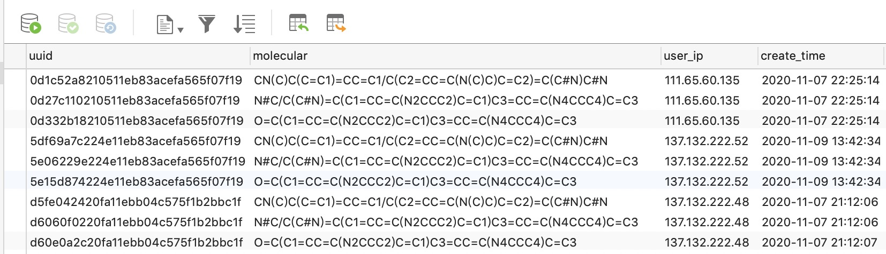

# Prediction of Molecular Optical Properties
## Paper

Submmited.

## Dataset

Dataset is composed of molecules with aggregation-induced emission (AIE) or aggregation caused quenching (ACQ) properties reported in the literature. When collecting data, we screened the molecules according to the following criteria: 1) capture representative AIE/ACQ counterparts that show similar molecular structures but opposite AIE/ACQ property; 2) screen molecules derived from the same AIE core, especially the classic cores. To avoid an unbalanced and biased dataset, we restricted the number of molecules derived from the same core. Totally , 356 molecules were collected for model training.

Download from:

Link:https://pan.baidu.com/s/1iWVFqAKTf98woIRWysyUbw  Password:q04b

## Environment

- python  3.6
- numpy  1.19.0
- pandas  1.0.5
- deepchem   2.2.1.dev54
- scikit-learn  0.21.0
- rdkit  2020.09.1b.69

## Usage

- Train models through ten-fold cross-validation.

  - descriptors.py    

    Get descriptors features.

  - crossvalidation_index.py    

    Get ten-fold cross-validation index.

  - crossvalidation_data.py    

    Get ten-fold cross-validation data.

  - train_models_ori.py    

    Train different models based on single-modal data.

  - train_models_mul.py    

    Train different models based on multi-modal data.
    
  - calculate_measures.py

    Calculate AUC and F1-score.

  - ensemble.py

    Calculate the ensemble method prediction results.

  - calculate_ensemble_measures.py 

    Calculate measures for ensemble method, including accuracy, AUC, and F1-score.

- Train models through the whole data.
  - data_process_all.py
  - train_models_ori_all.py
  - train_models_mul_all.py
  - predict.py

## Pretrained Models

We provide pre-training models based on the whole data, which can help you predict your new data. 

We also use the models in our user interface. 

Download from:

Link:https://pan.baidu.com/s/1m8JyMSIze8E8UHqqUMcrGA  Password:j1b9

## User Interface

We built a user interface for the project. The user can test the molecular optical properties through this interface. The models used here is the pre-trained models.

You can visit the following link：

http://123.56.152.117:5009/

Note that, we also connect the interface to the database. The test samples uploaded by the user are stored in the database, including the user's IP. The database is for scientific research only. The molecular structure is used to further synthesize the molecular and retraining models to achieve better prediction performance. IP is used to analyze the distribution of interested users.

## Contact

Jiali Li [e0276496@u.nus.edu](mailto:e0276496@u.nus.edu)

Xiaoli Liu [neuxiaoliliu@163.com](mailto:neuxiaoliliu@163.com)

Shidang Xu [xushidang@u.nus.edu](mailto:xushidang@u.nus.edu)

